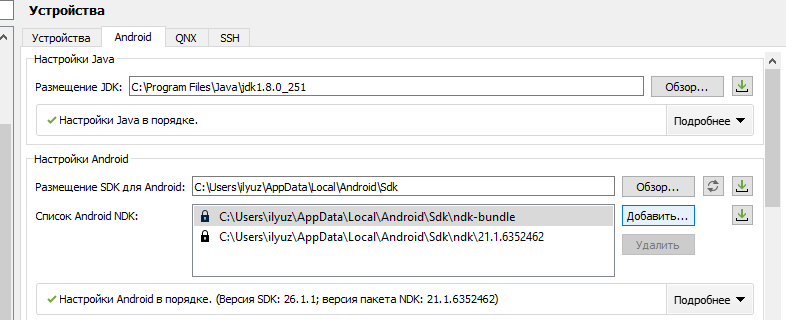
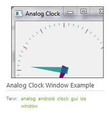
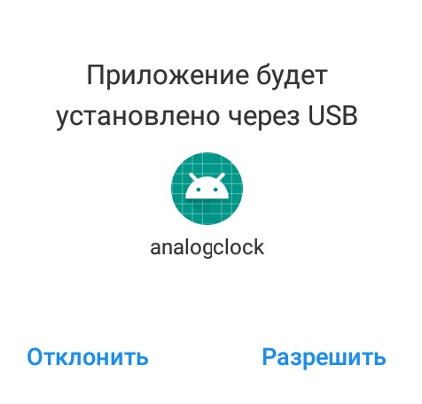

МИНИСТЕРСТВО НАУКИ И ВЫСШЕГО ОБРАЗОВАНИЯ РОССИЙСКОЙ ФЕДЕРАЦИИ\
Федеральное государственное автономное образовательное учреждение высшего образования\
"КРЫМСКИЙ ФЕДЕРАЛЬНЫЙ УНИВЕРСИТЕТ им. В. И. ВЕРНАДСКОГО"\
ФИЗИКО-ТЕХНИЧЕСКИЙ ИНСТИТУТ\
Кафедра компьютерной инженерии и моделирования\
  
​
### Отчёт по лабораторной работе № 7  по дисциплине "Программирование"
 

студента 1 курса группы ПИ-б-о-191(1)\
Завьялова Ильи Владиславовича\
направления подготовки 09.03.04 "Программная инженерия"\
 
​
<table>
<tr><td>Научный руководитель  старший преподаватель кафедры компьютерной инженерии и моделирования</td>
<td>(оценка)</td>
<td>Чабанов В.В.</td>
</tr>
</table>
  
​
Симферополь, 2020

* * *

## Цель:
1. Настроить IDE Qt Creator для разработки приложений под android ОС;
2. Изучить базовые понятия связанные с мобильной разработкой;
3. Научиться создавать мобильные приложения при помощи фреймворка Qt 5.14.

## Ход работы

_Рисунок №1 - Скриншот окна настроек QT_

_Рисунок №2 - Приложение, что я решил использовать_

_Рисунок №3 - Параметры сборки и запуска_

_Рисунок №4 - После успешной сборки_

_Рисунок №6 - Запущенное приложение_

* * *

## Вывод

Я настроил IDE Qt Creator для разработки приложений под Android OC. Изучил базовые понятия связанные с мобильной разработкой. Научился создавать мобильные приложения при помощи фреймворка Qt 5.14.
